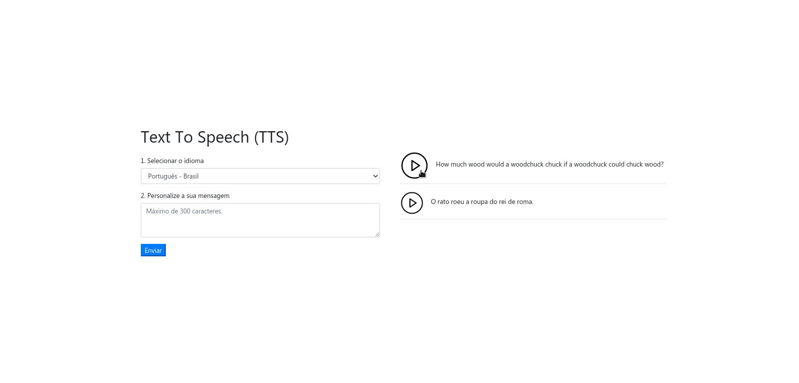

<h1 align="center">
    <br>
</h1>



# Summary

- [What is this?](#what-is-this)
- [Techs used](#techs-used)
- [Getting started](#getting-started)
- [Useful URLs](#useful-urls)

<a id="what-is-this"></a>

## :thinking: What is this?

This is the Client Side of my interview application in **Smarkio**.<br>
Basically, a web page made with Ajax concepts that consists of using the API that I maded (available below).

**Server-Side** available: [Here](https://github.com/matheus2x/smarkio-case-server/ "Server-Side")

<a id="techs-used"></a>

## :rocket: Techs used

- **Bootstrap** - A popular HTML, CSS, and JS library
- **Sass** - A CSS pre-processor
- **HTML5** - Mark Down Lang
- **JavaScript** - The Best code Lang
- **WebPack** - A JavaScript Module Bundler
- **Babel** - A JavaScript Transcompiler

<a id="getting-started"></a>

## :fire: Getting started

I am assuming that you have already started the server side

- ### You may **need** to install:

  - A Distributed **Version-Control-System** -> [Git](https://git-scm.com/ "Git")
  - A JavaScript **Interpreter** -> [Node.js](https://nodejs.org/ "Node.js")
  - Some **Package Manager** Like -> [NPM](https://www.npmjs.com/) **or** [Yarn](https://yarnpkg.com/)

1. Clone this repo with:

```sh
  $ git clone https://github.com/matheus2x/smarkio-case-client.git
```

2. Move yourself to the appropriate directory: `$ cd smarkio-case-client`
3. Run `$ npm install` to download dependencies
4. Run `$ npm run build` to gen bundle files
5. Run `$ npm run start` to initialize

<br>Now you have a local server (probably) in port 8080
<br>Enjoy =)

<a id="useful-urls"></a>

## :link: Useful URLs

- [Server-Side](https://github.com/matheus2x/smarkio-case-server/ "Server-Side")

---

- [Git](https://git-scm.com/ "Git")
- [Node](https://nodejs.org/ "Node")
- [Babel](https://babeljs.io/ "Babel")
- [Sass](https://sass-lang.com/ "Sass")
- [Bootstrap](https://getbootstrap.com/ "Bootstrap")
- [Webpack](https://webpack.js.org/ "Webpack")

---

<h4 align="center">
    Made with :fox_face: by <a href="https://www.linkedin.com/in/matheus2x/" target="_blank">Matheus Henrique</a>
</h4>
